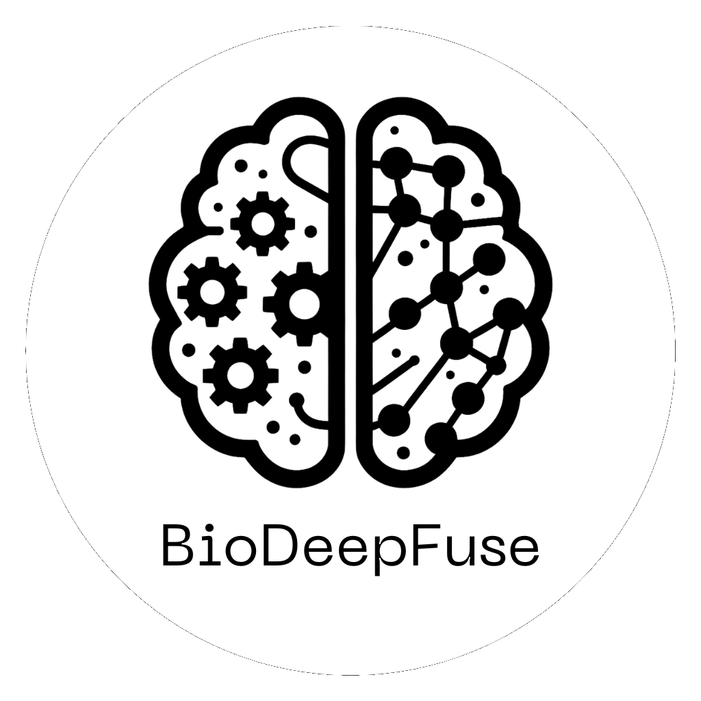

[](https://opensource.org/licenses/MIT)

<h1 align="center">
  
</h1>

<h3 align="center">BioDeepFuse: Empowering Researchers in Life Sciences with Deep Learning</h3>

<p align="center">
  <a href="https://github.com/brenoslivio/BioDeepFuse">Home</a> •
  <a href="#installing-dependencies-and-package">Installing</a> •
  <a href="#how-to-use">How To Use</a> •
  <a href="#citation">Citation</a> 
</p>

## Abstract

The accurate classification of non-coding RNA (ncRNA) sequences is pivotal for advanced non-coding genome annotation and analysis, a fundamental aspect of genomics that facilitates understanding of ncRNA functions and regulatory mechanisms in various biological processes. While traditional machine learning approaches have been employed for distinguishing ncRNA, these often necessitate extensive feature engineering. Recently, deep learning algorithms have provided advancements in ncRNA classification. This study presents BioDeepFuse, a hybrid deep learning framework integrating convolutional neural networks (CNN) or bidirectional long short-term memory (BiLSTM) networks with handcrafted features for enhanced accuracy. This framework employs a combination of k-mer one-hot, k-mer dictionary, and feature extraction techniques for input representation. Extracted features, when embedded into the deep network, enable optimal utilization of spatial and sequential nuances of ncRNA sequences. Using benchmark datasets and real-world RNA samples from bacterial organisms, we evaluated the performance of BioDeepFuse. Results exhibited high accuracy in ncRNA classification, underscoring the robustness of our tool in addressing complex ncRNA sequence data challenges. The effective melding of CNN or BiLSTM with external features heralds promising directions for future research, particularly in refining ncRNA classifiers and deepening insights into ncRNAs in cellular processes and disease manifestations. In addition to its original application in the context of bacterial organisms, the methodologies and techniques integrated into our framework can potentially render BioDeepFuse effective in various and broader domains.

## Authors

* Anderson P. Avila Santos $^\dagger$, Breno L. S. de Almeida $^\dagger$, Robson P. Bonidia, Peter F. Stadler, Polonca Stefanic, Denny Popp, Ines Mandic-Mulec, Ulisses Rocha, Danilo S. Sanches, and André C.P.L.F. de Carvalho

* **Correspondence:** Ulisses Nunes da Rocha. Email: ulisses.rocha@ufz.de

$\dagger$ The authors have contributed equally.

## Publication

Abstract accepted and presented at the 16th symposium on Genetics and Bacterial Ecology 2023 (BAGECO 2023), with the title:  **Feature Extraction Techniques based on Deep Learning Framework for Enhanced Classification of Non-coding RNA**.

Full paper: In submission.

## Installing dependencies and package

## Conda - Terminal

Installing the application using miniconda, e.g.:

```sh
$ git clone https://github.com/brenoslivio/BioDeepFuse.git BioDeepFuse

$ cd BioDeepFuse

$ git submodule init

$ git submodule update
```

**1 - Install Miniconda:** 


See documentation: https://docs.conda.io/en/latest/miniconda.html

```sh
$ wget https://repo.anaconda.com/miniconda/Miniconda3-latest-Linux-x86_64.sh

$ chmod +x Miniconda3-latest-Linux-x86_64.sh

$ ./Miniconda3-latest-Linux-x86_64.sh

$ export PATH=~/miniconda3/bin:$PATH
```

**2 - Create environment:**

```sh
conda env create -f environment.yml -n biodeepfuse
```

**3 - Activate environment:**

```sh
conda activate biodeepfuse
```

**4 - You can deactivate the environment, using:**

```sh
conda deactivate
```

## How to use

When running the application, it is possible to use diverse arguments. They are shown using the `--help` argument. The options available are:

```bash
  -train TRAIN, --train TRAIN
                        Folder with FASTA training files

  -test TEST, --test TEST
                        Folder with FASTA testing files

  -epochs EPOCHS, --epochs EPOCHS
                        Number of epochs to train

  -patience PATIENCE, --patience PATIENCE
                        Epochs to stop training after loss plateau

  -encoding ENCODING, --encoding ENCODING
                        Encoding - 0: One-hot encoding, 1: K-mer embedding, 2: No encoding (only feature extraction), 3: All encodings (without feature extraction)

  -k K, --k K           Length of k-mers

  -concat CONCAT, --concat CONCAT
                        Concatenation type - 1: Directly, 2: Using dense layer before concatenation

  -feat_extraction FEAT_EXTRACTION [FEAT_EXTRACTION ...], --feat_extraction FEAT_EXTRACTION [FEAT_EXTRACTION ...]
                        Features to be extracted, e.g., 1 2 3 4 5 6. 1 = NAC, 2 = DNC, 3 = TNC, 4 = kGap, 5 = ORF, 6 = Fickett Score

  -features_exist FEATURES_EXIST, --features_exist FEATURES_EXIST
                        Features extracted previously - 0: False, 1: True; Default: False

  -algorithm ALGORITHM, --algorithm ALGORITHM
                        Algorithm - 0: Support Vector Machines (SVM), 1: Extreme Gradient Boosting (XGBoost), 2: Deep Learning

  -num_convs NUM_CONVS, --num_convs NUM_CONVS
                        Number of convolutional layers

  -activation ACTIVATION, --activation ACTIVATION
                        Activation to use - 0: ReLU, 1: Leaky ReLU; Default: ReLU

  -batch_norm BATCH_NORM, --batch_norm BATCH_NORM
                        Use Batch Normalization for Convolutional Layers - 0: False, 1: True; Default: False

  -cnn_dropout CNN_DROPOUT, --cnn_dropout CNN_DROPOUT
                        Dropout rate between Convolutional layers - 0 to 1

  -num_lstm NUM_LSTM, --num_lstm NUM_LSTM
                        Number of LSTM layers

  -bidirectional BIDIRECTIONAL, --bidirectional BIDIRECTIONAL
                        Use Bidirectional LSTM - 0: False, 1: True; Default: False

  -lstm_dropout LSTM_DROPOUT, --lstm_dropout LSTM_DROPOUT
                        Dropout rate between LSTM layers - 0 to 1

  -output OUTPUT, --output OUTPUT
                        Output folder for classification reports.
```

Alternatively, you can run the experiments used for the paper in `run_experiments.sh`.

## Citation

If you use this application in a scientific publication, we would appreciate citations to the following conference abstract:

Anderson P Avila Santos, Breno L S de Almeida, Robson P Bonidia, Peter F Stadler, Ulisses N da Rocha, Danilo S Sanches, André C P L F de Carvalho, Feature Extraction Techniques based on Deep Learning Framework for Enhanced Classification of Non-coding RNA. In: 16th symposium on Genetics and Bacterial Ecology 2023 (BAGECO 2023), 2023, Copenhagen. New approaches/technologies in microbial ecology, 2023.

```sh
@conference{bageco2023,
    title        = "{Feature Extraction Techniques based on Deep Learning Framework for Enhanced Classification of Non-coding RNA}",
    author       = {Santos, Anderson P Avila and de Almeida, Breno L S and Bonidia, Robson P  and Stadler, Peter F and da Rocha, Ulisses N and Sanches, Danilo S and de Carvalho, André C P L F},
    year         = 2023,
    month        = {06},
    booktitle    = {New approaches/technologies in microbial ecology},
    address      = {Copenhagen, Denmark},
    pages        = {235},
    organization = {CAP Partner},
    url = {https://bageco2023.org/wp-content/uploads/2023/06/CAP-Partner_Bageco2023_programme_A5_abstract-korr10.pdf}
}
```
